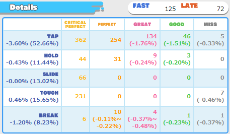

# maimai-score-details

Shows percent lost per note type in the score details section in maimai DX NET.

## How to use

1. Bookmark [this link](javascript:void(function(){document.body.appendChild(document.createElement('script')).src='https://raw.githubusercontent.com/SpiritsUnite/maimai-score-details/main/score-details.js'})();)
2. Go to a score page in maimai DX NET.
3. Open the bookmark on the page.